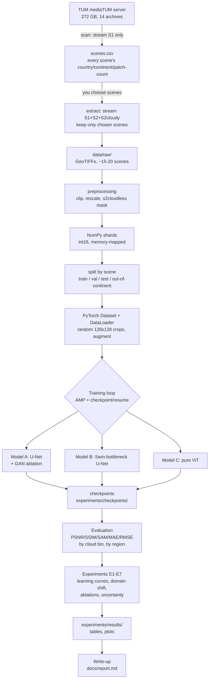
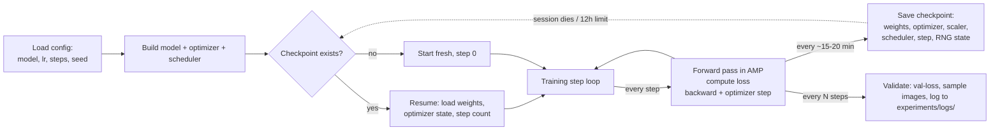
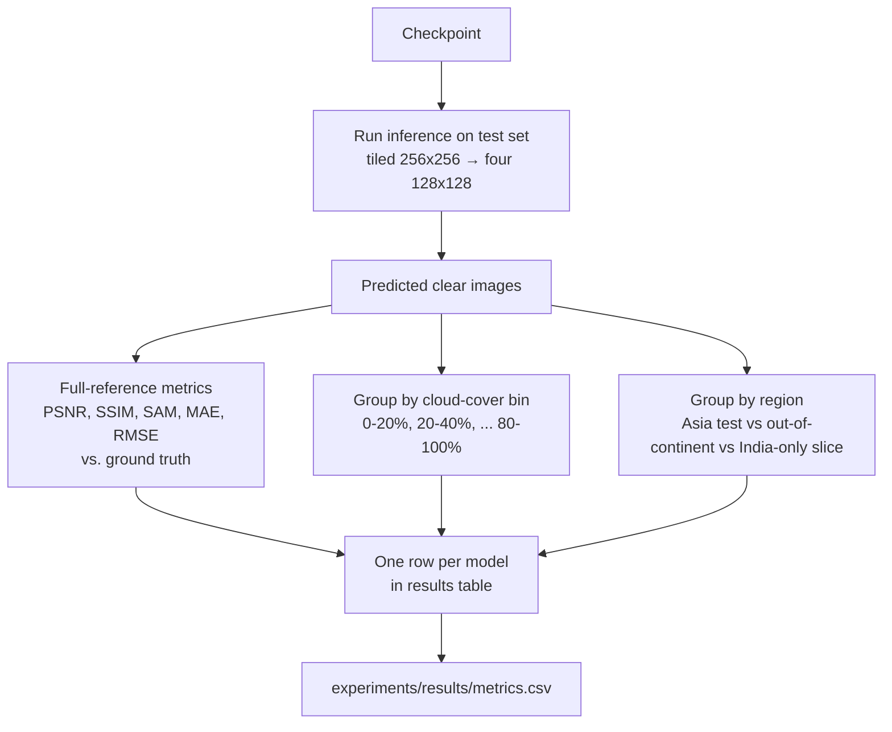
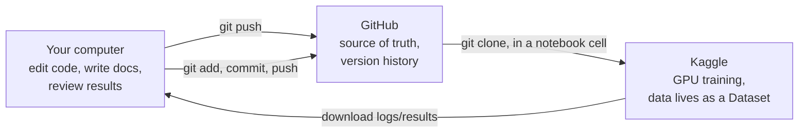

# ClearSAR — Full Project Architecture and Flow

This document is the single place that explains **how every piece connects** — from
a raw file sitting on a German university's server, to a number in your final
results table. Read `project_plan.md` for *what* to do and *why*; read this for
*how the system fits together*.

---

## 1. The one-paragraph version

A satellite takes a cloudy photo (Sentinel-2) and, around the same time, a radar
scan that sees through the clouds (Sentinel-1). You already have a historical
clear photo of the same ground (also Sentinel-2) that the dataset provides as the
answer key. You train a neural network to look at (radar + cloudy photo) and
predict (clear photo). You do this three times, with three different network
designs, under identical conditions, so the only thing that differs is the
architecture. You measure how close each prediction is to the real answer, run
seven additional experiments to understand *why* each architecture behaves as it
does, and write up what you learned.

---

## 2. End-to-end flow, top to bottom



Everything left of **Training loop** happens once. Everything from **Training
loop** onward happens three times (once per model), plus extra times for the
ablations in E3–E7.

---

## 3. What each top-level folder is, in the order you'll touch it

| Folder | What lives here | Who writes to it | Who reads from it | Tracked in git? |
|---|---|---|---|---|
| `docs/` | The plan, this document, the setup guide, eventually the final report | You | You, anyone reviewing the repo | Yes |
| `data/scans/` | `scenes.csv` — the lookup table of every SEN12MS-CR scene's location | `find_region_scenes.py scan` | `find_region_scenes.py extract`, your own notebooks | Yes (small file) |
| `data/raw/` | Extracted GeoTIFFs for your chosen scenes | `find_region_scenes.py extract` | `src/data` preprocessing code | **No** (ignored — too large, and anyone can regenerate it from `scenes.csv`) |
| `src/data/` | Scene finder, preprocessing, the `Dataset`/`DataLoader` classes, the train/val/test split logic | You, Week 1 | `src/training/` | Yes |
| `src/models/` | The three architectures (U-Net, Swin-U-Net, ViT), the PatchGAN discriminator, the uncertainty heads | You, Weeks 2–6 | `src/training/` | Yes |
| `src/training/` | The training loop itself: the part that ties a model + a dataset + a loss + an optimizer together and runs steps | You, Week 2 onward | Your Kaggle notebooks | Yes |
| `src/evaluation/` | Metric functions (PSNR, SSIM, SAM, UCE, AUSE, …) and plotting helpers | You, Week 1 (metrics) and Week 6–7 (uncertainty metrics, plots) | Your Kaggle notebooks, `experiments/results/` | Yes |
| `notebooks/` | Thin Kaggle notebooks: clone the repo, call functions from `src/`, save outputs | You | Kaggle | Yes (kept thin on purpose) |
| `experiments/checkpoints/` | Saved model weights | Training loop | Evaluation code | **No** (too large — re-generated by re-training, or kept locally outside git) |
| `experiments/logs/` | Training-loss CSVs, gradient-norm logs, LR-range-test results | Training loop | Your analysis / write-up | Yes (small text/CSV files) |
| `experiments/results/` | Final tables, final plots, anything that goes into the report | Evaluation code | `docs/report.md` | Yes |

**The rule that makes this work:** code and small artefacts go in git; large
regeneratable things (raw data, model weights) don't. If your laptop died
tomorrow, cloning the repo plus re-running `extract` and re-training would get
you back to exactly where you were — slower, but not lost.

---

## 4. The data pipeline, in detail

### 4.1 From server to `scenes.csv`

`find_region_scenes.py scan` streams *only* the Sentinel-1 archives (the smallest
of the three modalities) directly over the network — nothing is saved to disk
except the final CSV. For every scene it finds, it:
1. Reads one patch's GeoTIFF header to get the geographic centre (longitude,
   latitude).
2. Looks up the nearest populated place for that point (`reverse_geocoder`).
3. Maps that place's country to a continent (`continents.py`).
4. Counts how many patches that scene has.

Output: one row per scene, with season, scene number, patch count, coordinates,
country, continent, state, and nearest place name.

### 4.2 From `scenes.csv` to `data/raw/`

`find_region_scenes.py extract` reads your chosen filter (`--continent Asia`,
optionally capped with `--max-scenes`, plus any `--extra` out-of-continent
scenes), then streams the **S1, S2, and S2-cloudy** archives for just the
seasons that contain your chosen scenes — but this time it keeps and saves only
the files belonging to scenes you selected, discarding the rest as it streams
past them. This is why it still takes a while (it must read every file in the
archive to know whether to keep it) but produces a small output folder.

### 4.3 From `data/raw/` to training-ready tensors

This part lives in `src/data/` (to be built in Week 1) and has three jobs:

1. **Preprocessing** — per-file transforms, applied once and cached as shards:
   - SAR (VV, VH): already in dB. Clip VV to [−25, 0], VH to [−32.5, 0], rescale
     each to [0, 1].
   - Optical (cloudy and clear): clip to [0, 10000], rescale to [0, 1]. Keep all
     13 bands.
   - Cloud mask: run `s2cloudless` on the cloudy image, save the mask alongside
     (used later to bin results by cloud cover).
2. **Splitting** — decide, once, which scenes/patches are train/val/test/
   out-of-continent, and save that assignment to a file (not recomputed on the
   fly, so it never silently changes between runs).
3. **`Dataset` and `DataLoader`** — a PyTorch `Dataset` that, given an index,
   returns one training example: a 15-channel input tensor (2 SAR + 13 cloudy
   optical), a 13-channel target tensor (clear optical), and metadata (cloud
   fraction, scene id, region). Training uses random 128×128 crops with flips/
   rotations; evaluation uses the full 256×256 image, tiled into four 128×128
   pieces so every model is tested on identically-sized input.

**Why shards and not raw GeoTIFFs during training:** reading and reprojecting a
GeoTIFF on every training step is slow and will starve the GPU, especially with
only 4 CPU cores on Kaggle. Doing it once, up front, and saving plain NumPy
arrays makes every subsequent epoch fast.

---

## 5. The three models — what makes each one different, mechanically

All three take the **same 15-channel input** and produce the **same 13-channel
output**. They differ only in what happens between input and output.

### Model A — U-Net
```
input (15ch) → [down-block ×4] → bottleneck (conv) → [up-block ×4, with skip connections from matching down-block] → output (13ch)
```
Every down-block halves resolution and doubles channel count. Every up-block
does the reverse. Skip connections carry fine spatial detail straight across,
so the decoder doesn't have to reconstruct it from scratch.

**GAN ablation (still Model A):** add a second small network, the PatchGAN
discriminator, which looks at (input, output) pairs and scores small patches as
real or fake. The generator (the U-Net) is now trained to fool the
discriminator *as well as* match the target pixel-for-pixel. Nothing about the
U-Net itself changes — only the loss function and the presence of a second
network during training.

### Model B — Swin-bottleneck U-Net
Identical down-blocks and up-blocks to Model A. The only change: the plain
convolutional bottleneck is replaced with several **Swin Transformer blocks**,
which split the bottleneck's feature map into small windows, compute
self-attention *within* each window, then shift the window grid on alternating
layers so information can flow across window boundaries. This lets the network
mix information from distant parts of the image — useful when a cloud is
larger than any convolution's receptive field — while staying cheap, because
attention is computed only within small windows, not across the whole image.

### Model C — Pure ViT
No convolutions anywhere.
```
input (15ch, 128×128) → split into 8×8 patches (256 tokens) → linear embedding → [transformer layer ×8] → [transformer layer ×4] → linear "unpatchify" → output (13ch, 128×128)
```
Every token can attend to every other token from the very first layer — maximum
flexibility, but no built-in assumption that nearby pixels are related, which a
convolution gets for free. This is the whole point of the comparison: Model C
has to *learn* locality from data, where A and B get it architecturally.

### How uncertainty attaches (Model A only)
The U-Net's output layer is widened from 13 channels to 26: 13 predicted means
and 13 predicted variances. Training swaps the L1 loss for a negative
log-likelihood loss that penalizes both being wrong *and* being overconfident
about it. Two more uncertainty estimates come almost free: running the same
trained network 20 times with dropout left on (the spread across those runs is
one signal), and comparing your 3 differently-seeded models against each other
(their disagreement is another).

---

## 6. The training loop — what actually happens on Kaggle



The loop is written once, in `src/training/`, and reused for all three models —
only the config (which model class to instantiate, learning rate, loss
function) changes between runs. This is what makes the "identical protocol"
promise in the plan actually enforceable: it's the same code path, not three
separately hand-tuned scripts that have quietly drifted apart.

**Why the resume logic matters so much here:** Kaggle sessions cap out at 12
hours and can disappear without warning. Checkpointing every 15–20 minutes
means the worst case is losing 20 minutes of compute, not a whole run.

---

## 7. Evaluation — from a trained model to a table



Every metric function lives in `src/evaluation/` and is unit-tested once
(Week 1) against values you compute by hand on a tiny example — so a bug in a
metric doesn't quietly poison every result afterward.

---

## 8. How the seven experiments plug into this same pipeline

None of E1–E7 are separate systems — they're all the *same* training loop and
*same* evaluation code, run with one thing changed at a time:

| Experiment | What changes | What stays fixed |
|---|---|---|
| E1 — learning curves | Fraction of training data (25/50/100%) | Everything else, for all 3 models |
| E2 — domain shift | Test set (out-of-continent scenes instead of held-out Asia scenes) | The trained model itself — no retraining |
| E3 — U-Net probes | Model code: remove skip connections / swap L1→L2 | Data, training budget |
| E4 — GAN ablation | Loss function (add/remove adversarial term, vary λ) | U-Net architecture, data |
| E5 — Swin probes | Model code: shift on/off, window size | Everything else |
| E6 — ViT probes | Model code: remove positional embedding, patch size | Everything else |
| E7 — uncertainty | Output head + loss (variance head, dropout-at-test-time, ensembling) | Base U-Net architecture |

This is why the training loop and config system are worth building carefully in
Week 2: every later experiment is "run the same loop with one flag changed,"
not "write new training code."

---

## 9. The three-system loop you'll live in: local machine ↔ GitHub ↔ Kaggle



- **Code** flows: local → GitHub → Kaggle (via `git clone` inside the notebook).
- **Data** flows: local script → Kaggle Dataset (uploaded once, reused).
- **Results** flow: Kaggle → downloaded → local → committed to GitHub.
- Model weights stay out of git entirely; they travel as Kaggle Dataset
  versions or manual downloads, not as commits.

---

## 10. Putting it all together: one full week, concretely (using Week 4 as the example)

1. **Start of week:** `git pull` (if you touched the repo from elsewhere),
   check `README.md` checklist, open `docs/project_plan.md` §7 to confirm the
   week's goal: build Model B.
2. **Write code locally:** `src/models/swin_unet.py`, reusing the same
   `UNetDown`/`UNetUp` blocks Model A already defined, replacing only the
   bottleneck.
3. **Debug locally on the RTX 3050:** overfit-16-samples test, confirm loss
   goes to ~0.
4. **Commit:** `git add . && git commit -m "Week 4: Swin-bottleneck U-Net, overfit test passes" && git push`.
5. **Move to Kaggle:** open a notebook, `!git clone` your repo, point it at
   your Asia-subset Dataset, run the real training job via "Save & Run All".
6. **While it trains:** run E5's probes (window shift on/off, window size) as
   additional configs of the same run script.
7. **Download results:** loss curves, sample image grids, attention-map
   visualisations, metrics CSV → into `experiments/logs/` and
   `experiments/results/` locally.
8. **Commit again:** the logs and results (not the checkpoints).
9. **Update `README.md`:** tick the Week 4 box.
10. **Write your prediction-vs-result note** for E5 directly into
    `docs/report.md` (or a running notes file) while it's fresh.

Every other week follows this same shape — only step 2 (what you're building)
and step 6 (which experiments apply) change.

---

## 11. Quick reference: where do I look when...

| Question | Look here |
|---|---|
| "What am I supposed to be doing this week?" | `docs/project_plan.md` §7 |
| "Why are we doing this experiment?" | `docs/project_plan.md` §5, the "DL lesson" column |
| "What does this term mean?" | `docs/project_plan.md` §10, or the original glossary from v1 |
| "How do I get the data?" | This document §4, or `docs/project_plan.md` §2 |
| "How do the three models differ, mechanically?" | This document §5 |
| "How does training actually run on Kaggle?" | This document §6 |
| "How do I get code/data/results between my computer and Kaggle?" | This document §9, and `docs/setup_guide.md` §8 |
| "git isn't working" | `docs/setup_guide.md` §9 |
